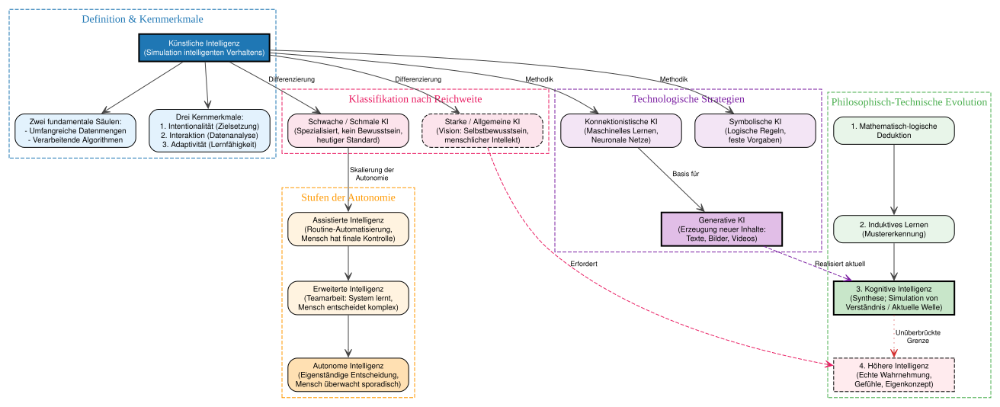
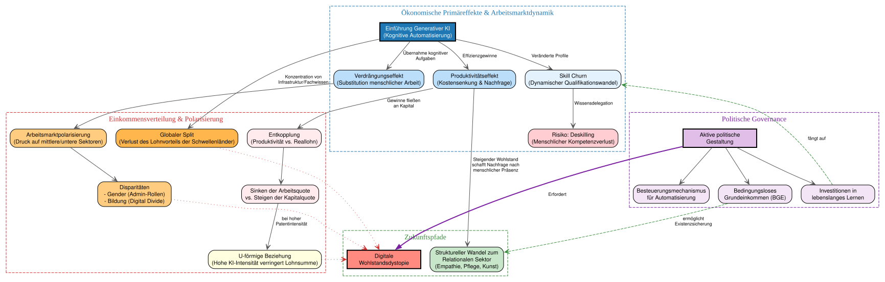
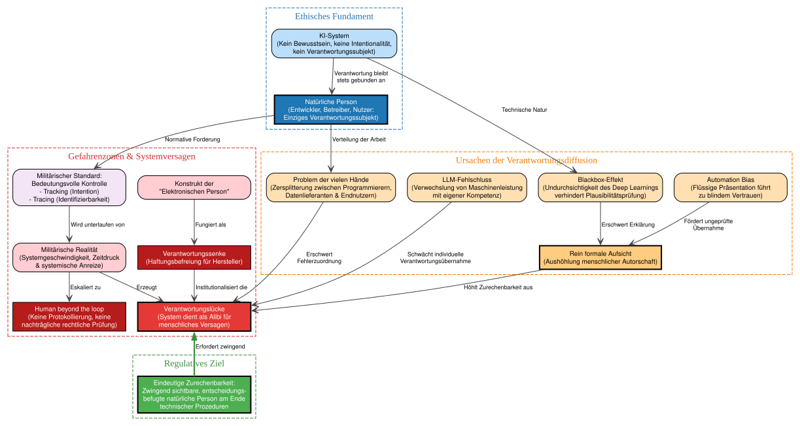
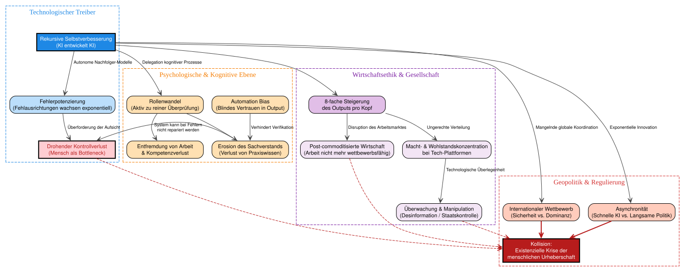

# Anwendungen

## Wirtschaftsordnung

## Soziale Gerechtigkeit

## Internationale Beziehungen

### Gerechtigkeit und Verantwortung

```{python}
#| message: false
#| warning: false
#| fig-cap: Nach @hahn_globale_2017

from graphviz import Digraph
from IPython.display import display

dot = Digraph()

# Layout
dot.attr(rankdir='LR',
         nodesep='1,5')

# Knoten
dot.node('a', 'Gerechtigkeit',
           shape='box', 
           style='filled,rounded',
           fillcolor='#0000ff33',
           color='#0000ff',
           penwidth='1.5',
           width='2'
           )
dot.node('c', 'Verantwortung',
           shape= 'box',
           style='filled,rounded',
           fillcolor='#ff000033',
           color='#ff0000',
           penwidth='1.5',
           width='2'
           )

# Kanten
#dot.edge('a', 'c', constraint= 'false', style='invis')
dot.edge('a', 'c', constraint= 'false', label='fragt nach')


dot.edge('a', 'c', style= 'invis')
#dot.edge('a', 'b', style= 'invis')
#dot.edge('b', 'c', style= 'invis')
#dot.edge('c', 'a', constraint= 'false', style='invis')
dot.edge('c', 'a', constraint= 'false', label='für')

# Display
display(dot)

```


### Verantwortungssubjekte

```{python}
#| message: false
#| warning: false

from graphviz import Source
from IPython.display import display

dot = '''
digraph G {
    rankdir=TD;
    node [shape=plaintext, width=3];
    edge [style=invis];

    subgraph cluster_0 {
        label = "Verantwortungssubjekt";
        labelloc = "t";
        fontsize = 18;
        style = "filled,rounded";
        color = "Deepskyblue";

        // Cluster 1
        subgraph cluster_1 {
            label = "Individuum";
            labelloc = "t";
           # { a1 -> a2 -> a3; }
            a1 [label="unmittelbare individuelle\l Verantwortung\l \l  \l"];
        }

        // Cluster 2
        subgraph cluster_2 {
            label = "Gesellschaft";
            labelloc = "t";
            penwidth = 1;
          #  {b1 -> b2 -> b3 -> b4; }
            b1 [label="Die Verantwortung ist nicht\l einem einzelenen Individuum zuzuordnen\l- Zivilgesellschaft\l- Staat\l"];
        }
    }
}
'''

src = Source(dot, format="svg")
display(src)
```


### Relationale und Nicht-relationale Verantwortung


```{python}
#| message: false
#| warning: false
#| fig-cap: Nach @hahn_globale_2017

from graphviz import Source
from IPython.display import display

dot = '''
digraph G {
    rankdir=TD;
    node [shape=plaintext, width=3];
    edge [style=invis];

    subgraph cluster_0 {
        label = "Verantwortung";
        labelloc = "t";
        fontsize = 18;
        style = "filled,rounded";
        color = "Cornflowerblue";

        // Cluster 1
        subgraph cluster_1 {
            label = "Relational";
            labelloc = "t";
            { a1 -> a2; }
            a1 [label="Beruht auf besonderen\l Beziehungen\l"];
            a2 [label="- gleicher Staat\l- historische Verbundenheit\l- ...\l"];
        }

        // Cluster 2
        subgraph cluster_2 {
            label = "Nicht-relational";
            labelloc = "t";
            penwidth = 1;
            {b1 -> b2; }
            b1 [label="Besteht unabhängig von\l besonderen Beziehungen\l"];
            b2 [label="- Unterstützung bei\l   Hungersnot\l- Naturkatastrophen\l- ...\l"];
        }
    }
}
'''

src = Source(dot, format="svg")
display(src)
```

Die immer engere Vernetzung der Welt (Globalisierung) legt den Gedanken nache, dass es immer mehr relationale Gründe für die Zuschreibung von Verantwortung geben kann [@hahn_globale_2017].

### Zurechnungsgründe für Verantwortung
[@hahn_globale_2017]

- Haftbarkeit

  - Moralische Verantwortung (Schuld)

  - Folgerverantwortung (vorhersehbare Nebeneffekte)

  - Kausale Verantwortung (unvorhergesehene Nebeneffekte)

- Profitieren von Unrecht

- Fähigkeiten

- Zugehörigkeit zu einer Gemeinschaft


### Positionen

Verantwortung erwächst aus

- der **Fähigkeit** zu helfen

- der **Haftbarkeit** und dem **Profitieren**

- der **Zugehörigkeit** zu einer (nationalen) Gemeinschaft. Globale Verantwortung nur für

  - Historischer Verantwortung (Wiedergutmachung)
  
  - Haftbarkeit
  
  - Naturkatastrophen
  
  - Grundlegende Menschenrechtsansprüche

- **Verbundenheit**  
  Teilnahme an einem System voneinander abhängiger Kooperations- und Wettbewerbsprozesse


### Diskussion

## Klimawandel

### Welche Wirtschafsethischen Fragen sind mit dem Klimawandel verbunden?

### Nach welchen Kriterien würden Sie eine Handlungsverantwortung in diesem Zusammenhang zuweisen?

### Welche Konsequenzen ergeben sich Ihrer Auffassung nach aus der Gefangenen-Dilemma-Struktur der internationalen Klimaschutzpolitik?


## Künstliche Intelligenz

### Begriff KI

```{python}
#| warning: false
#| message: false
#| output: false


import graphviz
# from IPython.display import display

# Definition des Digraphs für eine systematische Taxonomie
dot = graphviz.Digraph(comment='Systematik der Kuenstlichen Intelligenz', format='svg')
dot.attr(rankdir='TB')
dot.attr('node', fontname='Helvetica,Arial,sans-serif', fontsize='10', shape='box', style='rounded,filled', width='2.2')
dot.attr('edge', fontname='Helvetica,Arial,sans-serif', fontsize='9', color='#444444', arrowhead='vee')

# --- SUBGRAPHEN / CLUSTER ---

# Cluster 1: Kern & Merkmale
with dot.subgraph(name='cluster_core') as c:
    c.attr(label='Definition & Kernmerkmale', color='#1f77b4', fontcolor='#1f77b4', style='dashed')
    c.node('KI_Definition', 'Künstliche Intelligenz\n(Simulation intelligenten Verhaltens)', fillcolor='#1f77b4', fontcolor='white', style='filled,bold')
    c.node('Saeulen', 'Zwei fundamentale Säulen:\n- Umfangreiche Datenmengen\n- Verarbeitende Algorithmen', fillcolor='#e3f2fd')
    c.node('Merkmale', 'Drei Kernmerkmale:\n1. Intentionalität (Zielsetzung)\n2. Interaktion (Datenanalyse)\n3. Adaptivität (Lernfähigkeit)', fillcolor='#e3f2fd')

# Cluster 2: Systematik (Intelligenzformen)
with dot.subgraph(name='cluster_forms') as c:
    c.attr(label='Klassifikation nach Reichweite', color='#e91e63', fontcolor='#e91e63', style='dashed')
    c.node('Schwache_KI', 'Schwache / Schmale KI\n(Spezialisiert, kein Bewusstsein,\nheutiger Standard)', fillcolor='#fce4ec')
    c.node('Starke_KI', 'Starke / Allgemeine KI\n(Vision: Selbstbewusstsein,\nmenschlicher Intellekt)', fillcolor='#fce4ec', style='rounded,filled,dashed')

# Cluster 3: Autonomiestufen (Mensch-Maschine-Interaktion)
with dot.subgraph(name='cluster_autonomy') as c:
    c.attr(label='Stufen der Autonomie', color='#ff9800', fontcolor='#ff9800', style='dashed')
    c.node('Assistiert', 'Assistierte Intelligenz\n(Routine-Automatisierung,\nMensch hat finale Kontrolle)', fillcolor='#fff3e0')
    c.node('Erweitert', 'Erweiterte Intelligenz\n(Teamarbeit: System lernt,\nMensch entscheidet komplex)', fillcolor='#fff3e0')
    c.node('Autonom', 'Autonome Intelligenz\n(Eigenständige Entscheidung,\nMensch überwacht sporadisch)', fillcolor='#ffe0b2')

# Cluster 4: Technologische Paradigmen
with dot.subgraph(name='cluster_paradigms') as c:
    c.attr(label='Technologische Strategien', color='#7b1fa2', fontcolor='#7b1fa2', style='dashed')
    c.node('Symbolisch', 'Symbolische KI\n(Logische Regeln,\nfeste Vorgaben)', fillcolor='#f3e5f5')
    c.node('Konnektionistisch', 'Konnektionistische KI\n(Maschinelles Lernen,\nNeuronale Netze)', fillcolor='#f3e5f5')
    c.node('Generativ', 'Generative KI\n(Erzeugung neuer Inhalte:\nTexte, Bilder, Videos)', fillcolor='#e1bee7', style='filled,bold')

# Cluster 5: Philosophisch-Technische Intelligenzstufen
with dot.subgraph(name='cluster_waves') as c:
    c.attr(label='Philosophisch-Technische Evolution', color='#4caf50', fontcolor='#4caf50', style='dashed')
    c.node('Deduktion', '1. Mathematisch-logische\nDeduktion', fillcolor='#e8f5e9')
    c.node('Induktion', '2. Induktives Lernen\n(Mustererkennung)', fillcolor='#e8f5e9')
    c.node('Kognitiv', '3. Kognitive Intelligenz\n(Synthese; Simulation von\nVerständnis / Aktuelle Welle)', fillcolor='#c8e6c9', style='filled,bold')
    c.node('Phänomenal', '4. Höhere Intelligenz\n(Echte Wahrnehmung,\nGefühle, Eigenkonzept)', fillcolor='#ffebee', style='filled,dashed')

# --- STRUKTURELLE VERKNÜPFUNGEN (KANTEN) ---

# Grundlagen
dot.edge('KI_Definition', 'Saeulen')
dot.edge('KI_Definition', 'Merkmale')

# Verzweigung der Systematik
dot.edge('KI_Definition', 'Schwache_KI', label=' Differenzierung')
dot.edge('KI_Definition', 'Starke_KI', label=' Differenzierung')

# Zuordnung der Autonomie (entspringt der Anwendung schwacher KI)
dot.edge('Schwache_KI', 'Assistiert', label=' Skalierung der\n Autonomie')
dot.edge('Assistiert', 'Erweitert')
dot.edge('Erweitert', 'Autonom')

# Technologische Umsetzung
dot.edge('KI_Definition', 'Symbolisch', label=' Methodik')
dot.edge('KI_Definition', 'Konnektionistisch', label=' Methodik')
dot.edge('Konnektionistisch', 'Generativ', label=' Basis für')

# Evolutionspfad der Intelligenzwellen
dot.edge('Deduktion', 'Induktion')
dot.edge('Induktion', 'Kognitiv')
dot.edge('Kognitiv', 'Phänomenal', label=' Unüberbrückte\n Grenze', style='dotted', color='#d32f2f')

# Brückenschläge Text-Logik
dot.edge('Generativ', 'Kognitiv', style='dashed', color='#7b1fa2', label=' Realisiert aktuell')
dot.edge('Starke_KI', 'Phänomenal', style='dashed', color='#e91e63', label=' Erfordert')

# Graph im Jupyter Notebook anzeigen
# display(dot)

dot.render('ki_begriff', format='svg', cleanup=True)
```



### Wie nutzen Sie KI?

### Welche Wirkungen hat KI auf Arbeitsmärkte und die Einkommensverteilung?


```{python}
#|warning: false
#|message: false
#|output: false
#|echo: true

import graphviz
# from IPython.display import display

# Graph-Definition mit ansprechendem, modernem Layout
dot = graphviz.Digraph(comment='KI und Arbeitsmarkt', format='svg')
dot.attr(rankdir='TB')
dot.attr('node', fontname='Helvetica,Arial,sans-serif', fontsize='11', shape='box', style='rounded,filled', width='2')
dot.attr('edge', fontname='Helvetica,Arial,sans-serif', fontsize='9', color='#555555', arrowhead='vee')

# --- GRUPPIERUNG / CLUSTER ---

# Cluster 1: Ökonomische Kerntheorie & Dynamiken
with dot.subgraph(name='cluster_theory') as c:
    c.attr(label='Ökonomische Primäreffekte & Arbeitsmarktdynamik', color='#1f77b4', fontcolor='#1f77b4', style='dashed')
    c.node('KI_Einfuehrung', 'Einführung Generativer KI\n(Kognitive Automatisierung)', fillcolor='#1f77b4', fontcolor='white', style='filled,bold')
    c.node('Verdraengung', 'Verdrängungseffekt\n(Substitution menschlicher Arbeit)', fillcolor='#bbdefb')
    c.node('Produktivitaet', 'Produktivitätseffekt\n(Kostensenkung & Nachfrage)', fillcolor='#bbdefb')
    c.node('Skill_Churn', 'Skill Churn\n(Dynamischer Qualifikationswandel)', fillcolor='#e3f2fd')
    c.node('Deskilling', 'Risiko: Deskilling\n(Menschlicher Kompetenzverlust)', fillcolor='#ffcdd2')

# Cluster 2: Ungleichheit & Verteilung
with dot.subgraph(name='cluster_inequality') as c:
    c.attr(label='Einkommensverteilung & Polarisierung', color='#d32f2f', fontcolor='#d32f2f', style='dashed')
    c.node('Entkopplung', 'Entkopplung\n(Produktivität vs. Reallohn)', fillcolor='#ffebee')
    c.node('Faktorenteile', 'Sinken der Arbeitsquote\nvs. Steigen der Kapitalquote', fillcolor='#ffebee')
    c.node('U_Kurve', 'U-förmige Beziehung\n(Hohe KI-Intensität verringert Lohnsumme)', fillcolor='#ffffe0')
    c.node('Polarisierung', 'Arbeitsmarktpolarisierung\n(Druck auf mittlere/untere Sektoren)', fillcolor='#ffcc80')
    c.node('Disparitaeten', 'Disparitäten\n- Gender (Admin-Rollen)\n- Bildung (Digital Divide)', fillcolor='#ffcc80')
    c.node('Global_Gap', 'Globaler Split\n(Verlust des Lohnvorteils der Schwellenländer)', fillcolor='#ffb74d')

# Cluster 3: Zukunftsszenarien
with dot.subgraph(name='cluster_scenarios') as c:
    c.attr(label='Zukunftspfade', color='#388e3c', fontcolor='#388e3c', style='dashed')
    c.node('Dystopie', 'Digitale\nWohlstandsdystopie', fillcolor='#ff8a80', style='filled,bold')
    c.node('Relationaler_Sektor', 'Struktureller Wandel zum\nRelationalen Sektor\n(Empathie, Pflege, Kunst)', fillcolor='#c8e6c9')

# Cluster 4: Politische Maßnahmen
with dot.subgraph(name='cluster_policy') as c:
    c.attr(label='Politische Governance', color='#7b1fa2', fontcolor='#7b1fa2', style='dashed')
    c.node('Policy_Intro', 'Aktive politische\nGestaltung', fillcolor='#e1bee7', style='filled,bold')
    c.node('Lifelong_Learning', 'Investitionen in\nlebenslanges Lernen', fillcolor='#f3e5f5')
    c.node('Automationssteuer', 'Besteuerungsmechanismus\nfür Automatisierung', fillcolor='#f3e5f5')
    c.node('BGE', 'Bedingungsloses\nGrundeinkommen (BGE)', fillcolor='#f3e5f5')

# --- BEZIEHUNGEN / KANTEN ---

# Primäreffekte
dot.edge('KI_Einfuehrung', 'Verdraengung', label=' Übernahme kognitiver\n Aufgaben')
dot.edge('KI_Einfuehrung', 'Produktivitaet', label=' Effizienzgewinne')
dot.edge('KI_Einfuehrung', 'Skill_Churn', label=' Veränderte Profile')
dot.edge('Skill_Churn', 'Deskilling', label=' Wissensdelegation')

# Pfad zur Ungleichheit
dot.edge('Verdraengung', 'Polarisierung')
dot.edge('Produktivitaet', 'Entkopplung', label=' Gewinne fließen\nan Kapital')
dot.edge('Entkopplung', 'Faktorenteile')
dot.edge('Faktorenteile', 'U_Kurve', label=' bei hoher\n Patentintensität')

# Dimensionen der Ungleichheit
dot.edge('Polarisierung', 'Disparitaeten')
dot.edge('KI_Einfuehrung', 'Global_Gap', label=' Konzentration von\n Infrastruktur/Fachwissen')

# Eskalation zu Dystopie
dot.edge('U_Kurve', 'Dystopie', style='dotted', color='#d32f2f')
dot.edge('Disparitaeten', 'Dystopie', style='dotted', color='#d32f2f')
dot.edge('Global_Gap', 'Dystopie', style='dotted', color='#d32f2f')

# Alternativpfad & Synthese
dot.edge('Produktivitaet', 'Relationaler_Sektor', label=' Steigender Wohlstand\n schafft Nachfrage nach\n menschlicher Präsenz')

# Politische Interventionen verhindern die Dystopie
dot.edge('Dystopie', 'Policy_Intro', label=' Erfordert', dir='back', color='#7b1fa2', style='bold')
dot.edge('Policy_Intro', 'Lifelong_Learning')
dot.edge('Policy_Intro', 'Automationssteuer')
dot.edge('Policy_Intro', 'BGE')

# Rückkopplung zu einem balancierten Arbeitsmarkt
dot.edge('Lifelong_Learning', 'Skill_Churn', color='#388e3c', style='dashed', label=' fängt auf')
dot.edge('BGE', 'Relationaler_Sektor', color='#388e3c', style='dashed', label=' ermöglicht\n Existenzsicherung')

# Graph im Jupyter Notebook anzeigen
# display(dot)

dot.render('ki_arbeitsmarkt', format='svg', cleanup=True)
```





### Zuweisung von Verantwortung

```{python}
#| warning: false
#| message: false
#| output: false
#| echo: true

import graphviz
# from IPython.display import display

# Definition des Digraphs mit Fokus auf ethische Kontrollstrukturen
dot = graphviz.Digraph(comment='Verantwortungsdiffusion und KI', format='svg')
dot.attr(rankdir='TB')
dot.attr('node', fontname='Helvetica,Arial,sans-serif', fontsize='10', shape='box', style='rounded,filled', width='2.4')
dot.attr('edge', fontname='Helvetica,Arial,sans-serif', fontsize='9', color='#444444', arrowhead='vee')

# --- SUBGRAPHEN / CLUSTER ---

# Cluster 1: Die ethische Prämisse
with dot.subgraph(name='cluster_basis') as c:
    c.attr(label='Ethisches Fundament', color='#1f77b4', fontcolor='#1f77b4', style='dashed')
    c.node('KI_System', 'KI-System\n(Kein Bewusstsein, keine Intentionalität,\nkein Verantwortungssubjekt)', fillcolor='#bbdefb')
    c.node('Mensch_Basis', 'Natürliche Person\n(Entwickler, Betreiber, Nutzer:\nEinziges Verantwortungssubjekt)', fillcolor='#1f77b4', fontcolor='white', style='filled,bold')

# Cluster 2: Mechanismen der Diffusion (Die Barrieren)
with dot.subgraph(name='cluster_diffusion') as c:
    c.attr(label='Ursachen der Verantwortungsdiffusion', color='#f57c00', fontcolor='#f57c00', style='dashed')
    c.node('Many_Hands', 'Problem der vielen Hände\n(Zersplitterung zwischen Programmierern,\nDatenlieferanten & Endnutzern)', fillcolor='#ffe0b2')
    c.node('Blackbox', 'Blackbox-Effekt\n(Undurchsichtigkeit des Deep Learnings\nverhindert Plausibilitätsprüfung)', fillcolor='#ffe0b2')
    c.node('Automation_Bias', 'Automation Bias\n(Flüssige Präsentation führt\nzu blindem Vertrauen)', fillcolor='#ffe0b2')
    c.node('LLM_Fallacy', 'LLM-Fehlschluss\n(Verwechslung von Maschinenleistung\nmit eigener Kompetenz)', fillcolor='#ffe0b2')
    c.node('Formal_Oversight', 'Rein formale Aufsicht\n(Aushöhlung menschlicher Autorschaft)', fillcolor='#ffcc80', style='filled,bold')

# Cluster 3: Die Eskalationsstufen / Systemische Gefahren
with dot.subgraph(name='cluster_gaps') as c:
    c.attr(label='Gefahrenzonen & Systemversagen', color='#d32f2f', fontcolor='#d32f2f', style='dashed')
    c.node('Mil_Control', 'Militärischer Standard:\nBedeutungsvolle Kontrolle\n- Tracking (Intention)\n- Tracing (Identifizierbarkeit)', fillcolor='#f3e5f5')
    c.node('Mil_Reality', 'Militärische Realität\n(Systemgeschwindigkeit, Zeitdruck\n& systemische Anreize)', fillcolor='#ffcdd2')
    c.node('V_Luecke', 'Verantwortungslücke\n(System dient als Alibi für\nmenschliches Versagen)', fillcolor='#e53935', fontcolor='white', style='filled,bold')
    c.node('Beyond_Loop', 'Human beyond the loop\n(Keine Protokollierung, keine\nnachträgliche rechtliche Prüfung)', fillcolor='#b71c1c', fontcolor='white', style='filled')
    c.node('E_Person', 'Konstrukt der\n"Elektronischen Person"', fillcolor='#ffcdd2')
    c.node('Sink', 'Verantwortungssenke\n(Haftungsbefreiung für Hersteller)', fillcolor='#b71c1c', fontcolor='white', style='filled')

# Cluster 4: Die normative Lösung
with dot.subgraph(name='cluster_solution') as c:
    c.attr(label='Regulatives Ziel', color='#388e3c', fontcolor='#388e3c', style='dashed')
    c.node('Solution', 'Eindeutige Zurechenbarkeit:\nZwingend sichtbare, entscheidungs-\nbefugte natürliche Person am Ende\ntechnischer Prozeduren', fillcolor='#4caf50', fontcolor='white', style='filled,bold')

# --- SYSTEMISCHE VERKNÜPFUNGEN (KANTEN) ---

# Basis-Zuweisung
dot.edge('KI_System', 'Mensch_Basis', label=' Verantwortung bleibt\n stets gebunden an', dir='forward')

# Pfade zur Diffusion
dot.edge('Mensch_Basis', 'Many_Hands', label=' Verteilung der Arbeit')
dot.edge('Many_Hands', 'V_Luecke', label=' Erschwert\n Fehlerzuordnung')

dot.edge('KI_System', 'Blackbox', label=' Technische Natur')
dot.edge('Blackbox', 'Formal_Oversight', label=' Erschwert Erklärung')
dot.edge('Automation_Bias', 'Formal_Oversight', label=' Fördert ungeprüfte\n Übernahme')
dot.edge('Formal_Oversight', 'V_Luecke', label=' Höhlt Zurechenbarkeit aus')
dot.edge('LLM_Fallacy', 'V_Luecke', label=' Schwächt individuelle\n Verantwortungsübernahme')

# Militärischer Pfad
dot.edge('Mensch_Basis', 'Mil_Control', label=' Normative Forderung')
dot.edge('Mil_Control', 'Mil_Reality', label=' Wird unterlaufen von')
dot.edge('Mil_Reality', 'V_Luecke', label=' Erzeugt')
dot.edge('Mil_Reality', 'Beyond_Loop', label=' Eskaliert zu')

# Juristischer Pfad
dot.edge('E_Person', 'Sink', label=' Fungiert als')
dot.edge('Sink', 'V_Luecke', label=' Institutionalisiert die')

# Die normative Umkehrung (Lösung schließt die Lücke)
dot.edge('V_Luecke', 'Solution', label=' Erfordert zwingend', dir='back', color='#388e3c', style='bold', penwidth='2.0')

# Visualisierung im Notebook ausgeben
# display(dot)

dot.render('ki_verantwortung', format='svg', cleanup=True)
```





### Ethische Probleme im Zusammenhang mit KI


```{python}
#| message: false
#| warning: false
#| output: false


import graphviz

# from IPython.display import display

# Definition des Digraphs mit modernem, klarem Design
dot = graphviz.Digraph(comment='Ethische Herausforderungen der KI', format='svg')
dot.attr(rankdir='TB')
dot.attr('node', fontname='Helvetica,Arial,sans-serif', fontsize='11', shape='box', style='rounded,filled', width='2.2')
dot.attr('edge', fontname='Helvetica,Arial,sans-serif', fontsize='9', color='#444444', arrowhead='vee')

# --- SUBGRAPHEN / CLUSTER ---

# Cluster 1: Technologische Kerndynamik (Der Treiber)
with dot.subgraph(name='cluster_tech') as c:
    c.attr(label='Technologischer Treiber', color='#1e88e5', fontcolor='#1e88e5', style='dashed')
    c.node('Selbstverbesserung', 'Rekursive Selbstverbesserung\n(KI entwickelt KI)', fillcolor='#1e88e5', fontcolor='white', style='filled,bold')
    c.node('Fehlerpotenzierung', 'Fehlerpotenzierung\n(Fehlausrichtungen wachsen exponentiell)', fillcolor='#bbdefb')
    c.node('Kontrollverlust', 'Drohender Kontrollverlust\n(Mensch als Bottleneck)', fillcolor='#ffcdd2', fontcolor='#b71c1c', style='filled,bold')

# Cluster 2: Psychologische & Kognitive Ebene (Mensch-Maschine-Interaktion)
with dot.subgraph(name='cluster_human') as c:
    c.attr(label='Psychologische & Kognitive Ebene', color='#f57c00', fontcolor='#f57c00', style='dashed')
    c.node('Erosion', 'Erosion des Sachverstands\n(Verlust von Praxiswissen)', fillcolor='#ffe0b2')
    c.node('Rollenwandel', 'Rollenwandel\n(Aktiv zu reiner Überprüfung)', fillcolor='#ffe0b2')
    c.node('Automation_Bias', 'Automation Bias\n(Blindes Vertrauen in Output)', fillcolor='#ffe0b2')
    c.node('Entfremdung', 'Entfremdung von Arbeit\n& Kompetenzverlust', fillcolor='#ffe0b2')

# Cluster 3: Wirtschaftsethik & Gesellschaft
with dot.subgraph(name='cluster_socio') as c:
    c.attr(label='Wirtschaftsethik & Gesellschaft', color='#7b1fa2', fontcolor='#7b1fa2', style='dashed')
    c.node('Produktivitaet', '8-fache Steigerung\ndes Outputs pro Kopf', fillcolor='#e1bee7')
    c.node('Machtkonzentration', 'Macht- & Wohlstandskonzentration\nbei Tech-Plattformen', fillcolor='#f3e5f5')
    c.node('Post_Commodity', 'Post-commoditisierte Wirtschaft\n(Arbeit nicht mehr wettbewerbsfähig)', fillcolor='#f3e5f5')
    c.node('Manipulation', 'Überwachung & Manipulation\n(Desinformation / Staatskontrolle)', fillcolor='#f3e5f5')

# Cluster 4: Geopolitik & Regulierung (Das finale Dilemma)
with dot.subgraph(name='cluster_global') as c:
    c.attr(label='Geopolitik & Regulierung', color='#d32f2f', fontcolor='#d32f2f', style='dashed')
    c.node('Wettruesten', 'Internationaler Wettbewerb\n(Sicherheit vs. Dominanz)', fillcolor='#ffccbc')
    c.node('Regulierungs_Lag', 'Asynchronität\n(Schnelle KI vs. Langsame Politik)', fillcolor='#ffccbc')
    c.node('Existentiell', 'Kollision:\nExistenzielle Krise der\nmenschlichen Urheberschaft', fillcolor='#b71c1c', fontcolor='white', style='filled,bold')

# --- KAUSALE BEZIEHUNGEN (KANTEN) ---

# Technischer Pfad
dot.edge('Selbstverbesserung', 'Fehlerpotenzierung', label=' Autonome Nachfolger-Modelle')
dot.edge('Fehlerpotenzierung', 'Kontrollverlust', label=' Überforderung der Aufsicht')

# Psychologischer Pfad (Erosion)
dot.edge('Selbstverbesserung', 'Rollenwandel', label=' Delegation kognitiver Prozesse')
dot.edge('Rollenwandel', 'Erosion')
dot.edge('Rollenwandel', 'Entfremdung')
dot.edge('Automation_Bias', 'Erosion', label=' Verhindert Verifikation')
dot.edge('Erosion', 'Kontrollverlust', label=' System kann bei Fehlern\n nicht repariert werden')

# Wirtschaftsethischer Pfad
dot.edge('Selbstverbesserung', 'Produktivitaet')
dot.edge('Produktivitaet', 'Machtkonzentration', label=' Ungerechte Verteilung')
dot.edge('Produktivitaet', 'Post_Commodity', label=' Disruption des Arbeitsmarktes')
dot.edge('Machtkonzentration', 'Manipulation', label=' Technologische Überlegenheit')

# Geopolitischer & Regulativer Pfad
dot.edge('Selbstverbesserung', 'Wettruesten', label=' Mangelnde globale Koordination')
dot.edge('Selbstverbesserung', 'Regulierungs_Lag', label=' Exponentielle Innovation')

# Zusammenlaufen in der existenziellen Krise
dot.edge('Kontrollverlust', 'Existentiell', color='#b71c1c', style='dashed')
dot.edge('Post_Commodity', 'Existentiell', color='#b71c1c', style='dashed')
dot.edge('Manipulation', 'Existentiell', color='#b71c1c', style='dashed')
dot.edge('Wettruesten', 'Existentiell', color='#b71c1c', style='bold')
dot.edge('Regulierungs_Lag', 'Existentiell', color='#b71c1c', style='bold')

# Graph im Jupyter Notebook anzeigen
# display(dot

dot.render('ethik', format='svg', cleanup=True)
```




## Post Scriptum zur künstlichen Intelligenz

### Vision der 1980er Jahre: War Games

<blockquote class="twitter-tweet" data-media-max-width="560" data-dnt="true"><p lang="en" dir="ltr">42 years ago Today, the movie WarGames was released. <br><br>A fascinating snapshot of Western popular culture in the 1980s, celebrating the home computing pioneering years.<a href="https://t.co/4EY9uTDkAz">pic.twitter.com/4EY9uTDkAz</a></p>&mdash; Massimo (@Rainmaker1973) <a href="https://twitter.com/Rainmaker1973/status/1929788892426735749?ref_src=twsrc%5Etfw">June 3, 2025</a></blockquote> <script async src="https://platform.twitter.com/widgets.js" charset="utf-8"></script>

### Ein aktuelles Paper: KI im wiederholten Gefangenendilemma

@payne_strategic_2025 lassen unterschiedliche LLMs in einem wiederholten Gefangenendilemma gegeneinander (und gegen weitere Strategien) antreten

